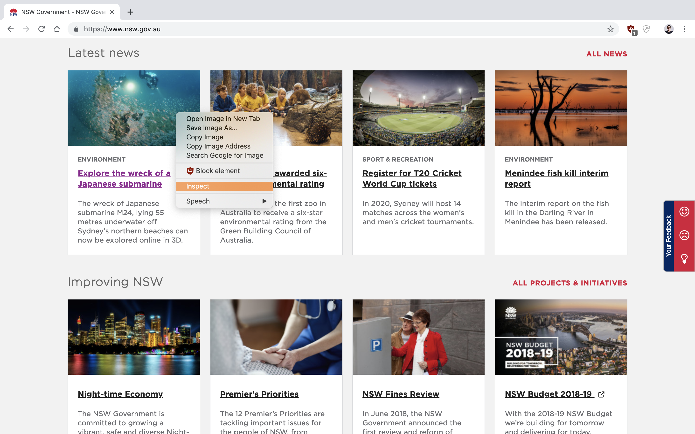
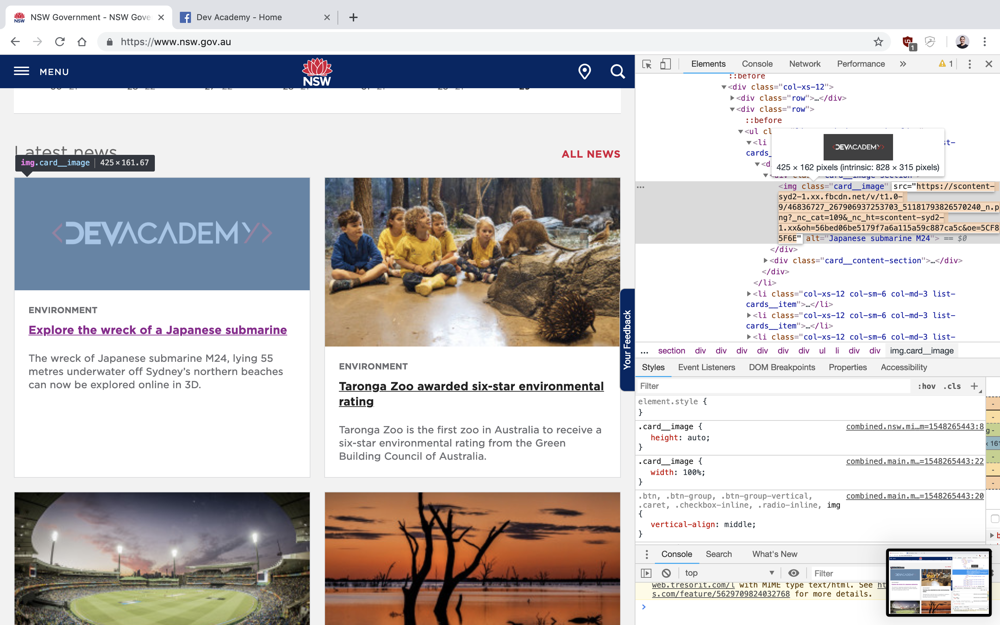
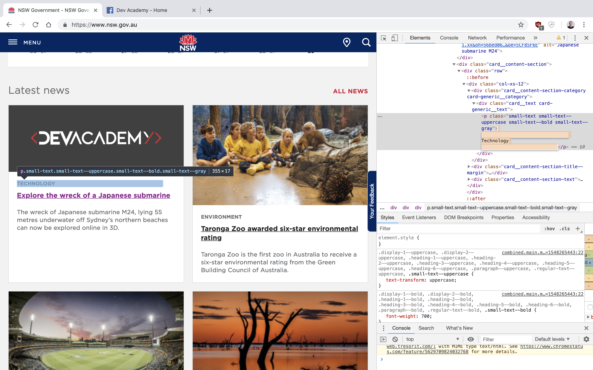
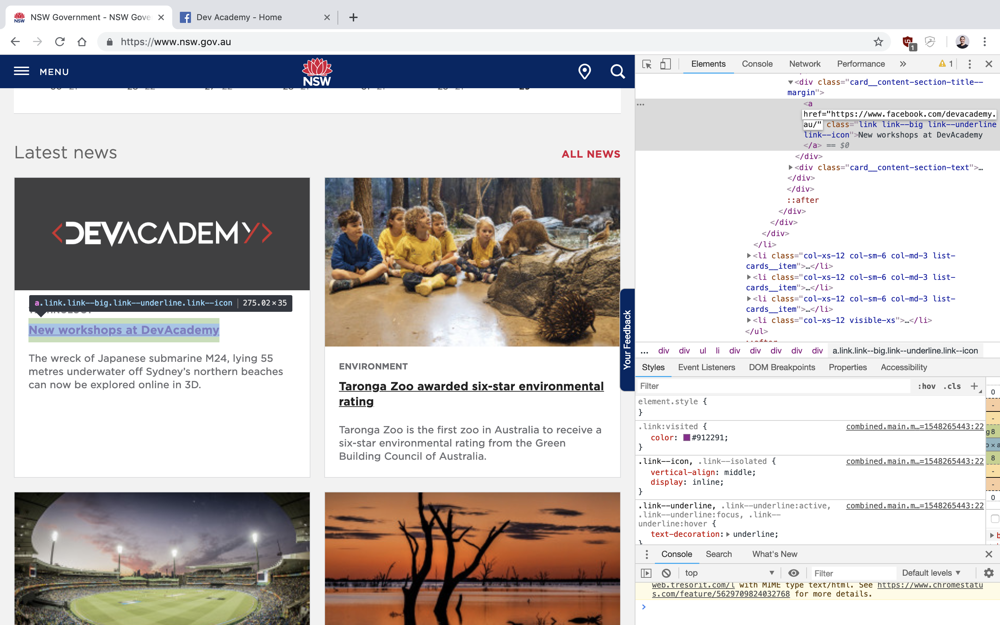
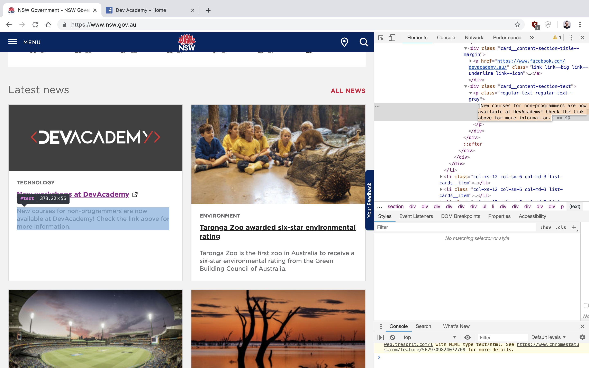

# Hacking the planet


You can check the video of this exercise available at our [Vimeo Channel](https://vimeo.com/315156482)


1. Choose  your target \(we gonna be using the [New South Wales Website](https://www.nsw.gov.au/) as an example\) 
2. Copy the Image address that you want to insert by 'right click -&gt; Copy Image Address'
3. Right-click on the image that you want to replace and click _Inspect_
4. Replace the `src="PASTE_YOUR_LINK_HERE"` element with your the link that you've copied
5. Now feel free to inspect and change any other elements on the page that you wish

