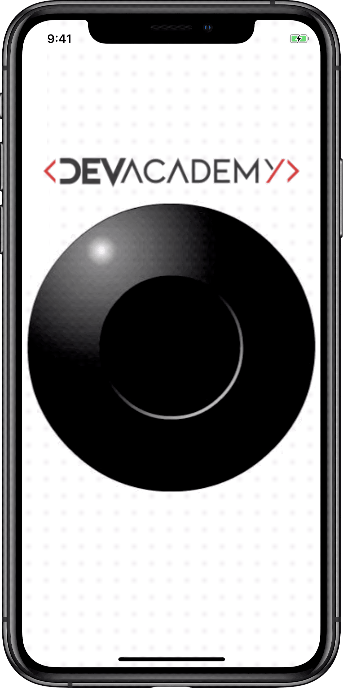
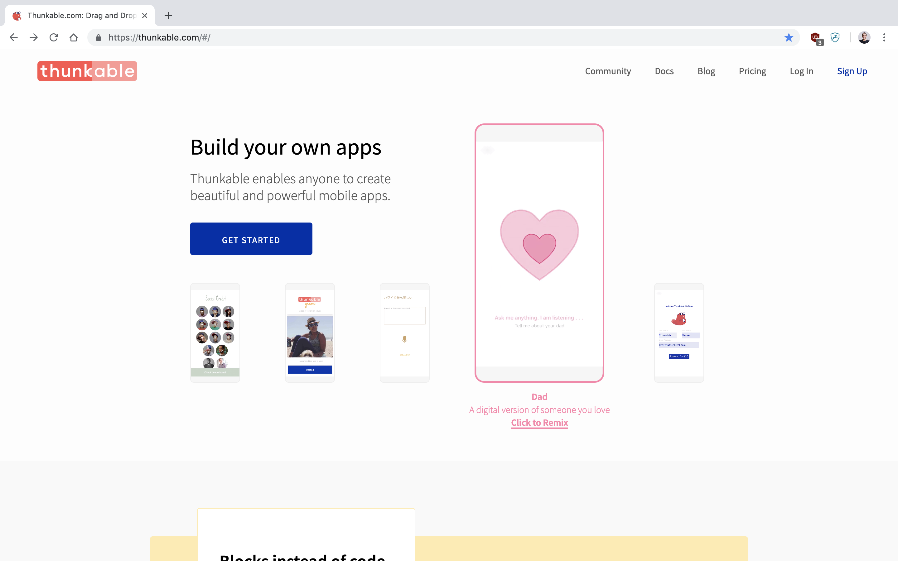
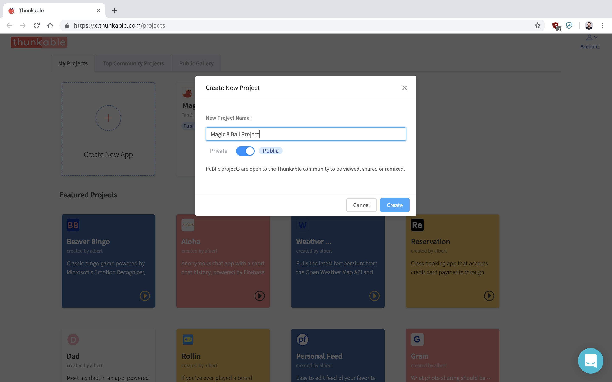
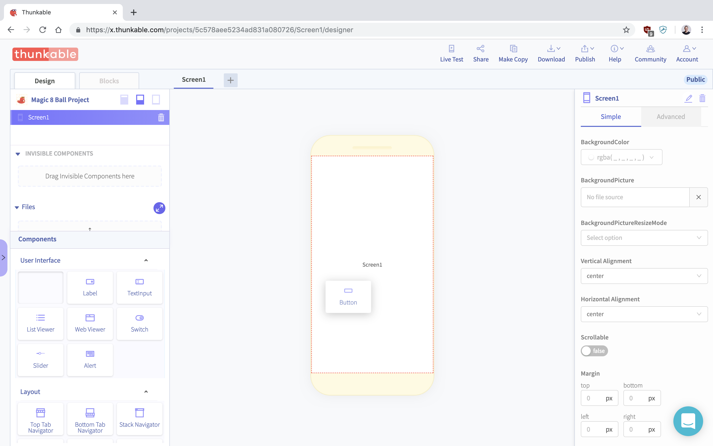
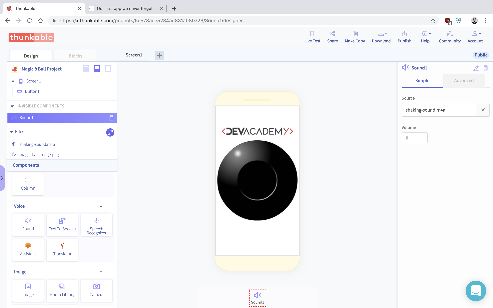
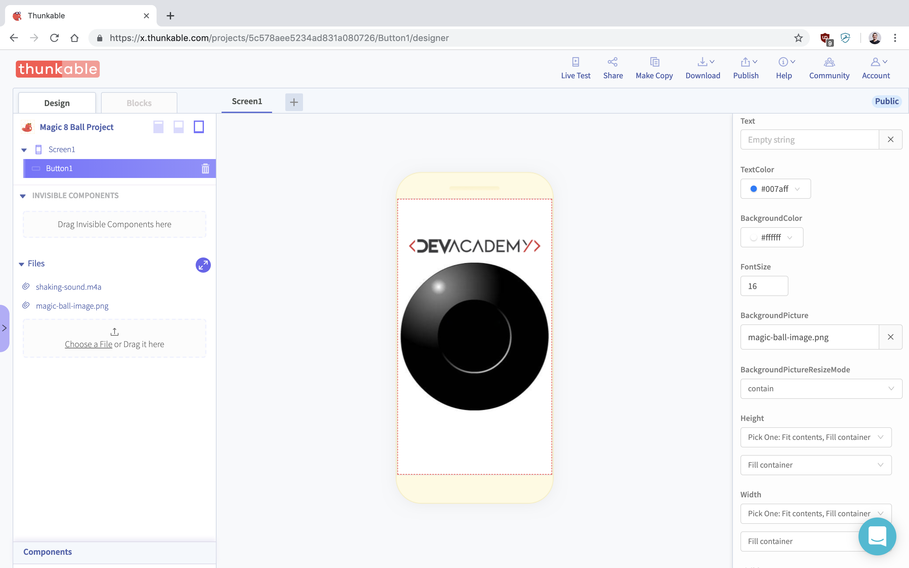
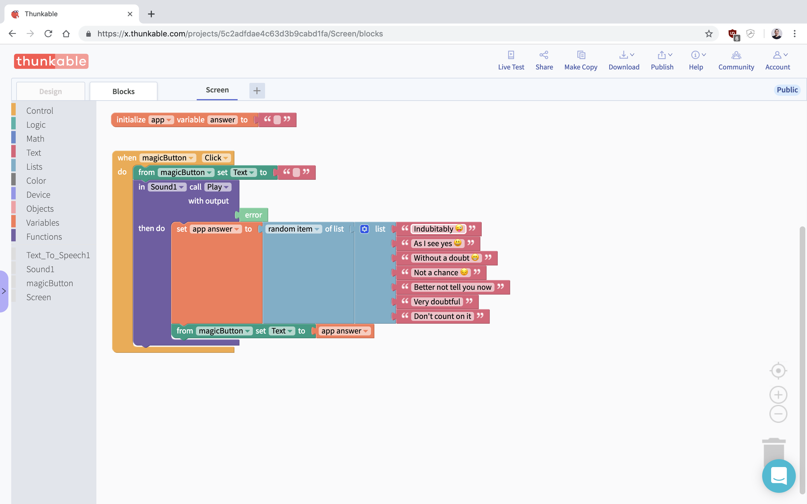
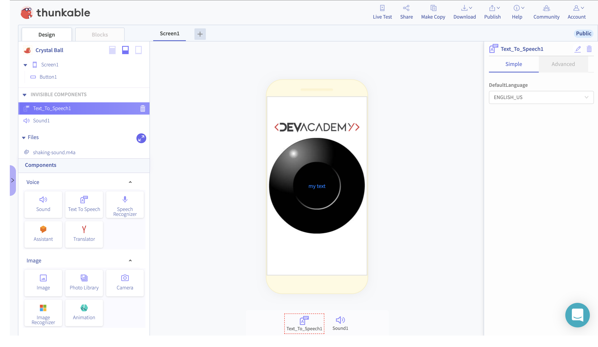
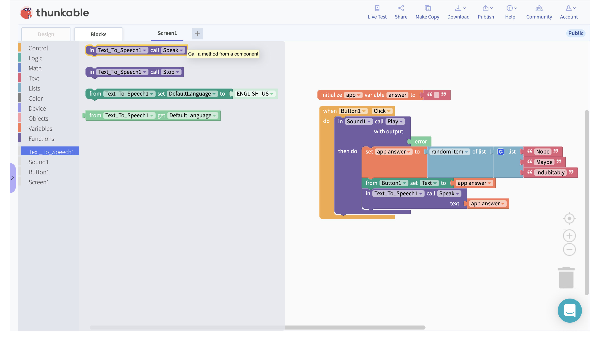

# Our first app we never forget

## What you’ll build?

You'll be creating a virtual version of the Magic 8 Ball!

You’ll implement a simple mobile app that generates magical answers. The user can touch the Magic Ball on the screen of their devices and the app will randomly select one of the phrases that you'll be creating and speak it to the user. There is no limit on how many answers we can have.


You can check the video of this exercise available at our [Youtube Channel](https://youtu.be/H9HWBGVw2_E)


For that we gonna be using a platform called [Thunkable](https://thunkable.com/#/)

Thunkable let us create our code with a technology called [Blockly](https://developers.google.com/blockly/) which let us 

> You can even add emojis to it by pressing `control + command + space`

Break it down into steps

1. Select a random item from the list
2. Set 3 items
3. Create an **empty** **box** \(variable\)
4. Give it a name to your box \(label\)
5. Put/Save your answer to your **box**
6. When clicking the button 
7. Display the text in the **box** \(variable\)

## Publishing

Check the links below in order to publish your app for iOS or Android

[Publish to the Play Store](https://docs.thunkable.com/thunkable-cross-platform/publish/publish-to-play-store-android)

[Publish to Apple Store](https://docs.thunkable.com/thunkable-cross-platform/publish/publish-to-app-store-ios)

## Challenge

Now that you've successfully created your app, try adding the [Text To Speech](https://docs.thunkable.com/thunkable-classic-android/create/components/voice/text-to-speech) functionality 

